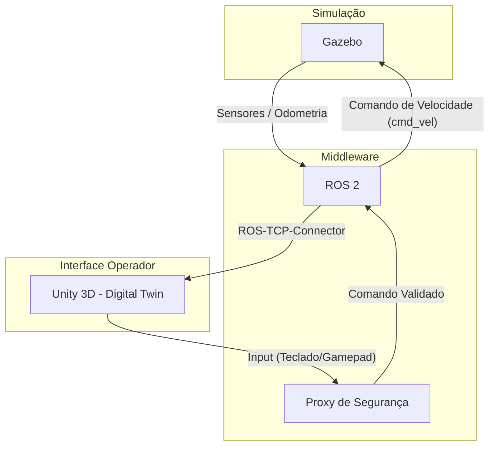

# Projeto 2 | Digital Twin & Teleoperação 🤖

> Um sistema de teleoperação segura para inspeção remota de ambientes perigosos, conectando a simulação do Gazebo a um gêmeo digital interativo na Unity.


## ✨ Visão geral

O projeto combina um robô móvel simulado no **Gazebo** com um **Gêmeo Digital (Digital Twin)** desenvolvido na **Unity**. O operador acompanha o estado do robô em tempo real e pode controlá-lo remotamente por uma interface 3D, com validação dos comandos antes que eles cheguem à simulação.

## 🧭 Navegação

- [Funcionalidades](#-funcionalidades)
- [Arquitetura](#️-arquitetura-do-sistema)
- [Estrutura](#-estrutura-do-repositório)
- [Pré-requisitos](#️-pré-requisitos)
- [Execução](#️-como-executar)
- [Demonstração](#-demonstração)

## 🚀 Funcionalidades

| Área             | O que está disponível                                                        |
| ---------------- | ---------------------------------------------------------------------------- |
| **Locomoção**    | Simulação física e cinemática de um robô com tração diferencial no Gazebo.   |
| **Percepção**    | Odometria e sensores como LiDAR e câmera para coleta de dados espaciais.     |
| **Digital Twin** | Representação 3D do robô e do ambiente em tempo real na Unity.               |
| **Comunicação**  | Integração bidirecional entre Gazebo e Unity usando ROS 2 como middleware.   |
| **Segurança**    | Proxy intermediário para validar a integridade e a autorização dos comandos. |

### Modos de controle

O padrão de projeto **State** organiza os modos de operação do robô:

- `Autônomo`: navegação e desvio de obstáculos com base nos sensores.
- `Manual`: controle do operador por teclado ou gamepad na Unity.
- `Emergência`: interrupção imediata dos movimentos e bloqueio de comandos.

## 🏗️ Arquitetura do Sistema

A comunicação entre a simulação e o gêmeo digital flui da seguinte maneira:



## 📁 Estrutura do Repositório

```text
├── gazebo_ros_ws/            # Workspace do ROS 2 (Backend e Simulação)
│   ├── src/                  # Código fonte dos nós em Python/C++
│   ├── launch/               # Arquivos de inicialização (.launch.py)
│   └── urdf/                 # Modelos 3D do robô para o Gazebo
├── unity_digital_twin/       # Projeto da Unity (Frontend e Gêmeo Digital)
│   ├── Assets/               # Scripts C#, Modelos, Cenas e Materiais
│   └── Packages/             # Dependências da Unity (ROS-TCP-Connector)
├── .gitignore                # Arquivos ignorados pelo Git
└── README.md                 # Documentação do projeto
```

## 🛠️ Pré-requisitos

Para executar este projeto localmente, você precisará ter instalado:

- **Ubuntu 22.04** (Recomendado) ou WSL2 com interface gráfica.
- **ROS 2 Humble**
- **Gazebo** (Ignition ou Classic, dependendo da versão configurada).
- **Unity Hub & Unity Editor** (Versão 2022.3 LTS ou superior).
- Pacote **ROS-TCP-Connector** na Unity.
- Pacote **ROS-TCP-Endpoint** no ROS 2.

## ⚙️ Como Executar

### 1. Iniciando o Ambiente ROS 2 / Gazebo

Abra um terminal, navegue até a pasta do workspace e compile o projeto:

```bash
cd gazebo_ros_ws
colcon build
source install/setup.bash
```

Inicie a simulação do Gazebo e os nós de controle:

```bash
ros2 launch meu_pacote_robo simulacao.launch.py
```

Inicie o endpoint de comunicação TCP e o Proxy de Segurança:

```bash
ros2 run ros_tcp_endpoint default_server_endpoint
ros2 run meu_pacote_robo proxy_seguranca_node
```

### 2. Iniciando o Digital Twin na Unity

1. Abra o **Unity Hub**.
2. Adicione o projeto selecionando a pasta `/unity_digital_twin`.
3. Abra a cena principal localizada em `Assets/Scenes/Main.unity`.
4. No menu do Unity, vá em `Robotics -> ROS Settings` e verifique se o IP e a porta conferem com o servidor ROS.
5. Clique no botão **Play** (▶) na Unity.
6. Utilize as teclas `W A S D` para controlar o robô e observe a simulação no Gazebo respondendo aos comandos.

## 🎥 Vídeo de Demonstração

[Insira aqui o link do YouTube ou Google Drive com o vídeo de demonstração do projeto funcionando]

## ✍️ COLABORADORES

- **Victor Souza Ferreira**
